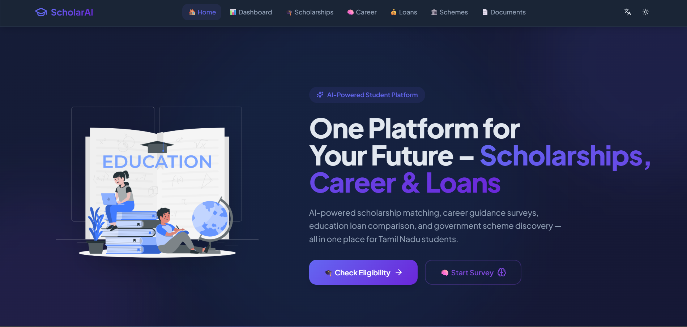
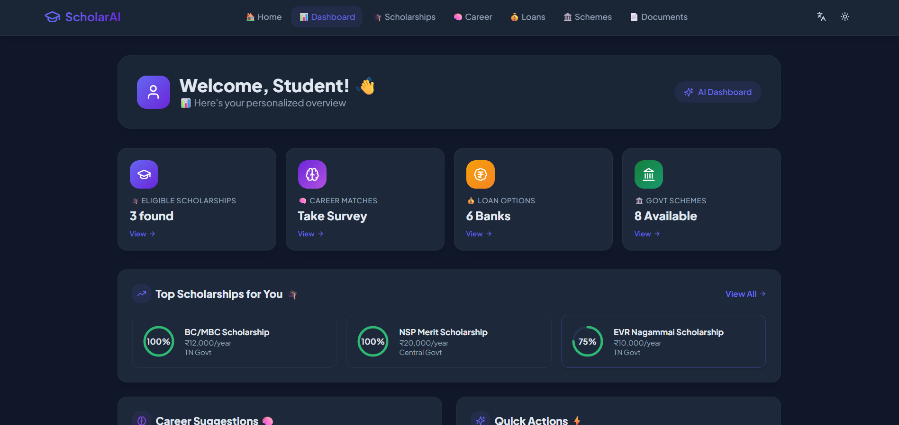
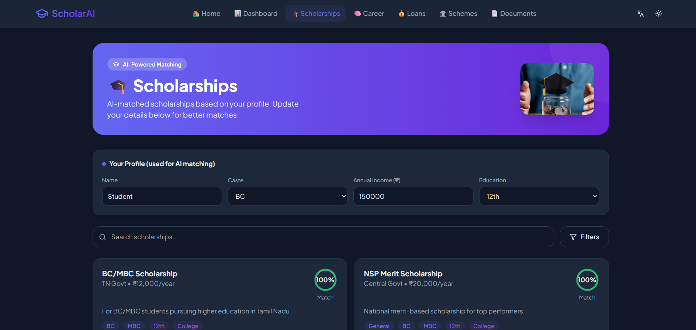
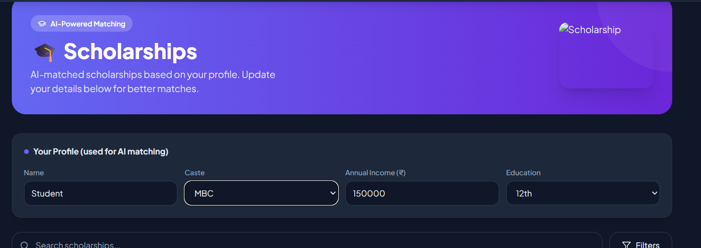
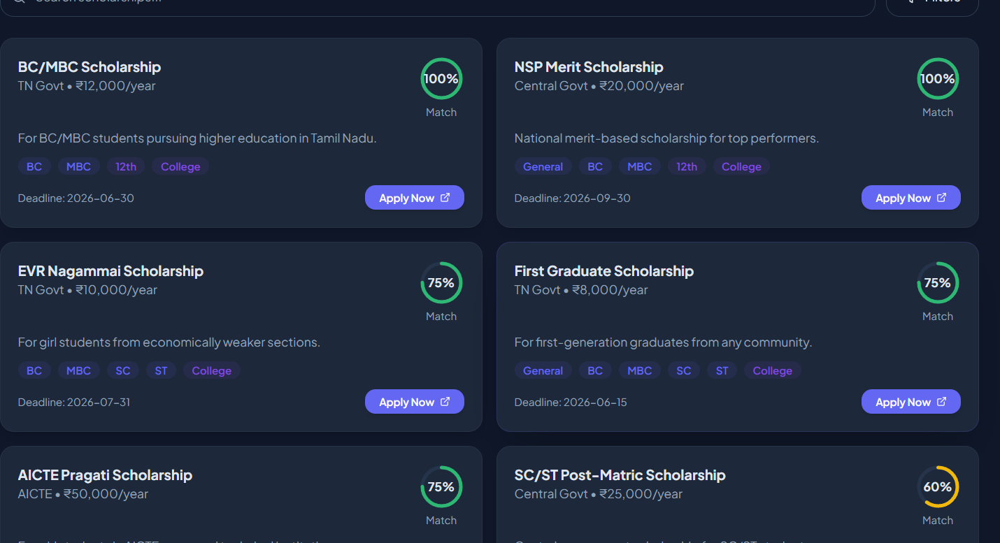

# 🎓 StudyNanba – AI-Powered Scholarship & Loan Recommendation System

---

## 🚀 Problem Statement
In India, millions of students face difficulty in finding suitable scholarships, government schemes, and education loans due to scattered information and lack of personalized guidance. This leads to missed opportunities and confusion in decision-making.

---

## 💡 Solution
StudyNanba is an AI-powered platform that provides personalized recommendations for scholarships, loans, and government schemes based on user profile such as income, category, and education level.

---

## 🔥 Key Features
- 🎯 Personalized scholarship recommendations  
- 🏦 Loan suggestions based on financial condition  
- 📄 Document verification assistance  
- 📊 Simple and user-friendly interface  
- 🧠 AI-based decision support  

---

## 🛠️ Tech Stack
- Frontend: React (Vite), Tailwind CSS  
- Backend: FastAPI (if used)  
- Language: JavaScript / Python  
- Data Handling: JSON / Dataset  

---

## 📸 Screenshots

### 🏠 Home Page


### 📊 Dashboard


### 🎓 Scholarship Portal


### 📥 Input Form


### 📤 Output Results


---

## 🔄 Workflow
1. User inputs details  
2. System processes eligibility  
3. AI recommends scholarships  
4. Results displayed

## 🧠 AI Logic
Currently uses rule-based filtering and dataset mapping.
Future upgrade includes ML-based recommendation system.

## ▶️ How to Run the Project

```bash
npm install
npm run dev


---

🚀 Future Scope
- Real-time API integration
- Mobile application
- Advanced ML model
- Multi-language support

🎯 Impact
Helps students easily discover opportunities
Reduces manual effort in searching schemes
Improves accessibility to education resources

🚀 Future Improvements
Real-time database integration
Mobile application support
Advanced AI recommendation model
Multi-language support

📫 Contact
GitHub: https://github.com/Bharathwajpm
Email: bharath129116@gmail.com

⭐ Building real-world AI solutions to solve real problems
c
